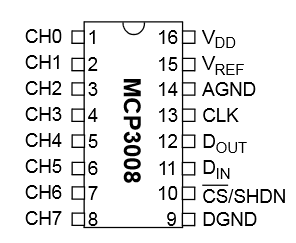
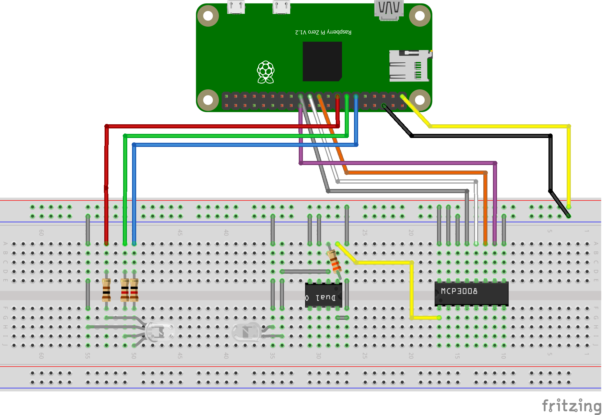
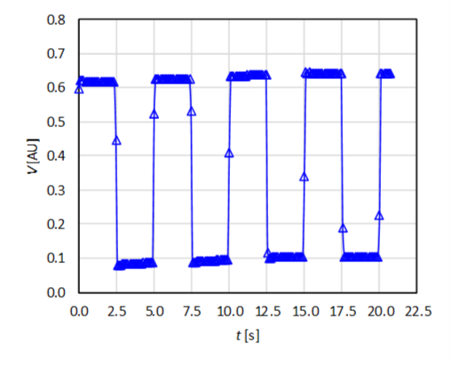

# Building a DIY photometer using a Raspberry Pi

Part 1b of the practical will use some of the Python basics from Part 1a to build and program a do-it-yourself photometer based around a Raspberry Pi (RPi) microcomputer.

Part 2 will then use the photometer to study the kinetics of the oxidation reaction between NaClO (household bleach) and Brilliant Blue FCF food dye.

<hr>


## Contents

<ol>
  <li>
    <a href="#Sec1">RPi basics</a>
    <ol type="a">
      <li><a href="#Sec1a">Getting started</a></li>
      <li><a href="#Sec1b">Accessing the Pi OS over secure shell (SSH)</a></li>
      <li><a href="#Sec1c">A short Linux (Bash) shell primer</a></li>
      <li><a href="#Sec1d">File transfer with WinSCP</a></li>
    </ol>
  </li>
  <li>
    <a href="#Sec2">Building the photometer</a></li>
    <ol type="a">
      <li><a href="#Sec2a">Electronics 1: LEDs</a></li>
      <li><a href="#Sec2b">Electronics 2: Photodiodes and analogue-to-digital converters</a></li>
      <li>
        <a href="#Sec2c">Electronics 3: Measurement program</a>
          <ol type="i">
            <li><a href="#Sec2c_i">Averaging readings</a></li>
            <li><a href="#Sec2c_ii">Writing data to a file</a></li>
            <li><a href="#Sec2c_iii">Extension task 1: Measuring square and triangle waves</a></li>
            <li><a href="#Sec2c_iv">Extension taks 2: Avoid overwriting previous data</a></li>
          </ol>
      </li>
     </ol>
   </li>
  <li><a href="#Sec3">Summary and next steps</a></li>
  <li>
    <a href="#Sec4">Appendix</a>
    <ol type="a">
      <li><a href="#Sec4a">Parts list</a></li>
      <li><a href="#Sec4b">Raspberry Pi setup</a></li>
      <li><a href="#Sec4c">Alternative connection with USB</a></li>
    </ol>
  </li>
  <li><a href="#Sec5">Notes and acknowledgements</a></li>
</ol>

<hr>


## 1. RPi basics <a name="Sec1"></a>

The Raspberry Pis are a family of low-cost single-board computers created by the [Raspberry Pi Foundation](https://www.raspberrypi.org/about/) with the aim of encouraging more students into programming.

Since the first RPi was released in 2012, they have become a very popular platform for "internet of things" (IoT) devices and have been used in projects ranging from environmental monitoring to home automation.

Microcomputers like the Pi are also useful for research because they allow researchers to build and test custom apparatus, either from scratch or by acting as a bridge to control other laboratory equipment in software.
When a lab or company develops a new scientific instrument, the early development often involves prototypes designed around programmable controllers like the Pi.

In this practical, you will be using the Raspberry Pi Zero W, which is designed to be a fully-functional computer costing ~£10.
A photo of a Pi zero with the main components marked is shown below:

<p align="center">
  
</p>

The Zero W is based around a low-power system-on-a-chip (SoC) (1) that contains a 1 GHz single-core CPU, 512 Mb RAM and a low-power graphics chip.
Although this hardware is slower than even a mid-range smartphone, it is surprisingly capable and is sufficient to run a fully-featured operating system.

The board uses a micro SD card for storage (2) and takes a 5 V USB power supply (i.e. a standard phone charger) (3).
It has a mini HDMI port that can be used to connect a monitor or TV (4), and a micro USB port (5) for connecting a keyboard/mouse or other devices.
It also has a wireless module that provides WiFi and Bluetooth support.
The WiFi will be used to work with the Pi during this practical.

Most importantly, the board has a set of general-purpose input/output pins (GPIO pins) (6) that can be controlled from software to interface to electronic components.
The GPIO pins will be used to power and control the photometer hardware.


### a. Getting started <a name="Sec1a"></a>

The Pi has been set up with the "Raspbian" Linux operating system (OS).
"Linux" is a family of free, open-source operating systems that provide an alternative to e.g. Windows or MacOS, and its uses range from high-performance computing (HPC) platforms for research to a wide variety of common "smart" devices, most notably Android phones which are based on a modified Linux "core".
[Raspbian](https://www.raspbian.org) is a customised version of Debian Linux for RPi computers.

The Pi has been set up to broadcast a WiFi hotspot that can be joined from a laptop.
The name (SSID) of the hotspot is printed on a sticker on the underside of the board.

Switch the Pi on by connecting the power supply.
The green light next to the USB power connector should light up to show it is booting.

Wait a minute or so for it to finish, then use a laptop to scan for wireless networks.
Once the hotspot appears, join it using the password `r@5pb377y`.

<p align="center">
  
</p>

<table>
  <tr>
    <td width="100">
      
    </td>
    <td>
      When connected to the Pi hotspot, the WiFi cannot be used to to access the internet, including these instructions - it might therefore be wise to save a copy before you connect.
      It is of course possible to disconnect and reconnect as required.
    </td>
  </tr>
</table>


### b. Accessing the Pi OS over secure shell (SSH) <a name="Sec1b"></a>

Once connected to the hotspot, the Pi operating system can be accessed using the secure shell (`ssh`) protocol.
SSH enables a local (client) computer to log in to a remote (server/host) machine over a network with a command-line interface (a "shell") that can be used to perform most, if not all, of the tasks that can be done using a graphical desktop (e.g. file management, starting and running programs, *etc*.).
(SSH is widely used for working with Linux systems remotely, and is used, for example, by computational chemists to access HPC systems.)

On Windows, the [PuTTY program](https://www.ssh.com/ssh/putty/) can be used to start an SSH connection:

* Launch PuTTY, enter `10.3.141.1` in the Host Name field, and click "Open"

<p align="center">
  
</p>

* If this is the first time PuTTY has seen the connected Pi, it may show a warning - click "Yes"
* When prompted for a username and password, use: `pi` and `r@5pb377y!`

Once logged in, a command prompt similar to the following should appear.
This allows Linux shell commands to be sent to the Pi.

<p align="center">
  
</p>

(For Mac users: connect to the Pi hotspot and log in by opening the `Terminal` app and typing `ssh pi@10.3.141.1`.)

<table>
  <tr>
    <td width="100">
      
    </td>
    <td>
      The string of numbers 10.3.141.1 is the Pi's Internet Protocol (IP) address - a unique identifier that allows it to be located on a network.
      Web browsers use the same mechanism to locate and connect to the servers hosting websites, but normally go through a domain-name system (DNS) server that takes a more memorable address, such as google.com, and looks up the corresponding physical IP address.
    </td>
  </tr>
</table>


### c. A short Linux (Bash) shell primer <a name="Sec1c"></a>

Those already familiar with the Linux Bash shell may skip this section; for everyone else, the following is a quick demonstration of some of the basic commands required to work with the Pi:

```bash
$ pwd
/home/pi
```

The `pwd` command prints the current working directory.
The location `/home/pi` is the Linux equivalent of the User folder on Windows (e.g. `C:\Users\jskelton\`) and is equivalent to the Home folder on MacOS.

```bash
$ ls

$ mkdir "Practical"
$ ls
Practical
```

The `ls` command, without any arguments, prints out (lists) the contents of the current directory.
`mkdir "Practical"` makes a new directory (folder) called "Practical".
Running `ls` again confirms that the directory was created successfully.

```bash
$ cd "Practical"
$ pwd
/home/pi/Practical
```

`cd "<directory>"` is used to change directory; typing `pwd` again confirms that the working directory is now the "Practical" folder created with the `mkdir` command.

There are a number of command-line text editors that can be used to create and edit files on Linux systems, for example `nano`:

```bash
$ nano "Test.py"
```

This creates an empty file called "Test.py" and displays it in an editor interface like the screenshot below.
Enter the following very simple Python script:

```python
print("Hello, Pi!")
```

<p align="center">
  
</p>

As displayed at the bottom of the editor window, `nano` uses keyboard shortcuts of the form `Ctrl + <function>` to cut, paste, save, *etc*.
To save the file, type `Ctrl + O`.
A prompt will appear to confirm the file name to save to - press the return key.
Exit the editor by typing `Ctrl + X`.

The script can be run from the command line using the `python` command:

```bash
$ python "Test.py"
Hello, Pi!

```

The `python` command starts the Python interpreter and instructs it to run the script file passed as an argument.

The `exit` command disconnects the SSH session and closes the connection:

```bash
$ exit
```

Finally, to shut down the Pi safely so the power supply can be disconnected, the `shutdown` command can be used:

```bash
$ sudo shutdown now
```

The `sudo` prefix tells the Pi to execute the command as a "super user" - this is equivalent to having administrative privileges on Windows or MacOS.
Administrative status is required to run the `shutdown` command from the terminal, because a Linux system being accessed remotely will often have multiple users logged in at once.
The `now` argument tells the shutdown program to execute immediately, as opposed to scheduling a shutdown for the future.

Shortly after the command executes, the SSH connection will be terminated and PuTTY will display an error message.
The green light on the Pi will blink for a few seconds, then turn off.
At this point, the power supply can be safely disconnected.
Reconnecting it again will cause the Pi to power up - this takes the place of a physical power switch.

<table>
  <tr>
    <td width="100">
      
    </td>
    <td>
      The Pi should be shut down properly before the power is disconnected.
      Like most modern computers, disconnecting the power while the Pi is running is unlikely to do any damage, and is sometimes necessary e.g. to force a reboot if the Pi hangs or becomes unaccessible over the network.
      However, there is a small risk of corrupting the SD card and losing any code/data stored on it.
    </td>
  </tr>
</table>

Here is a summary of these commands for quick reference (replace angle brackets with file/folder names):

* `pwd` : <u>p</u>rint <u>w</u>orking <u>d</u>irectory
* `ls` : <u>l</u>i<u>s</u>t current directory
* `cd <directory>` : <u>c</u>hange <u>d</u>irectory to &lt;directory&gt;
* `mkdir <directory>` : <u>m</u>a<u>k</u>e <u>dir</u>ectory &lt;directory&gt;
* `nano <file>` : open &lt;file&gt; in the `nano` text editor (creates the file if it doesn't already exist)
* `python <file>` : execute &lt;file&gt; with the Python interpreter
* `exit` : log out and terminate the SSH session
* `sudo shutdown now` : shutdown the Pi (also terminates the SSH session)


### d. File transfer with WinSCP <a name="Sec1d"></a>

To transfer files to and from the Pi, it is convenient to use a graphical file-transfer program such as [WinSCP](https://winscp.net).
WinSCP uses the secure file-transfer protocol (SFTP) to transfer files to and from a remote computer, and is a useful companion to an SSH client like PuTTY.

Open the program, enter the login details used with PuTTY, and click "Login" (Host name: `10.3.141.1`, User name: `pi`, Password: `r@5pb377y!`).

<p align="center">
  
</p>

As with PuTTY, if this is the first time WinSCP has seen the Pi, it will show a warning message - answer "Yes".
Once connected, an interface similar to the following should be displayed:

<p align="center">
  
</p>

The left-hand pane is for browsing the local computer, while the right-hand pane shows the file system on the Pi.
In the screenshot above, the browser is in the `/home/pi` directory, with the "Practical" folder created while working through the previous section.
Files can be dragged and dropped from one pane to the other to transfer in either direction.
There are also options to create files and folders, and double-clicking a file on the Pi will open it in a text editor that can be used as an alternative to `nano` if desired.

Note that WinSCP does not update the browser window on the remote machine automatically, so after creating a file from the command line (e.g. by running a program) it may be necessary to right-click > "Refresh" in the second pane to see it.

(For Mac users: WinSCP is a Windows-only program, but [FileZilla](https://filezilla-project.org) is a good alternative.)

<hr>


## 2. Building the photometer <a name="Sec2"></a>

<hr>

### a. Electronics 1: LEDs <a name="Sec2a"></a>

The first step is to build a circuit to power and control a light-emitting diode (LED) from a Python script running on the RPi - this will be used as the light source for the photometer.
For this practical, an RGB (<u>r</u>ed, <u>g</u>reen, <u>b</u>lue) LED has been provided that can produce three different colours, allowing the software to select from three different wavelengths.

LEDs are electroluminescent devices that produce photons of light by passing an electrical current through a semiconductor material.
The material used in the LED determines the the emission wavelength (colour) - this particular LED uses an InAlGaP alloy for the red emitter (&lambda;<sub>max</sub> = 620 nm) and InGaN alloys for the green and blue emitters (&lambda;<sub>max</sub> = 525/460 nm).

LEDs require two connections: an anode, connected to a power supply, and a cathode, through which current flows to the ground.
An RGB LED has three anodes, one for each semiconductor, and a common (shared) cathode.

LEDs require a minimum forward voltage to emit light - shorter-wavelength emission generally requires a higher voltage, while longer-wavelength emission requires a lower voltage.
From the [data sheet](https://cdn.shopify.com/s/files/1/0174/1800/files/YH5MMRGBC-4YW.pdf?18352150365029489229), the red and green/blue semiconductors are rated for forward voltages of 2.1 and 3.2 V respectively.

The brightness of an LED is proportional to the current flowing through it.
The three independent LEDs are each designed to operate at a typical 20 milliamp (mA) forward current, and the anode connections must be made through an appropriate resistor to limit the current at or below this level - otherwise the LED will quickly burn out.

Ohm's is used to calculate the required resistance as follows:

<!-- Unfortunately, GitHub Markdown doesn't yet support MathJax. -->

<p align="center">
    
</p>

where <i>V</i><sub>S</sub> and <i>V</i><sub>F</sub> are the (power) supply voltage and LED forward voltage, <i>I</i><sub>F</sub> is the desired forward current through the LED, and <i>R</i> is the required resistance.

The GPIO pins on the Pi can supply a maximum *total* 50 mA of current at 3.3 V, and around 15 mA on any one pin, so <i>V</i><sub>S</sub> = 3.3 V and <i>I</i><sub>F</sub> = 15 &times; 10<sup>-3</sup> A.
Using <i>V</i><sub>F</sub> = 2.1, an 80 &Omega; resistor would be required for the red anode.
Using <i>V</i><sub>F</sub> = 3.2 V, 6.7 &Omega; resistors would be required for the green and blue anodes.

Resistors are manufactured in a wide range of standard values, and resistors with the required or *higher* value should be selected - using a resistor with a higher resistance simply limits the current and decreases the LED brightness proportionally.
For this setup, 105 and 12.5 &Omega; resistors have been provided.

<table>
  <tr>
    <td width="100">
      
    </td>
    <td>
      Resistors typically have a set of 4-6 coloured bands printed on the housing that indicate the resistance and the tolerance.
      The easiest way to convert the band colours to resistance values is to use as website such as <a href="https://www.digikey.co.uk/en/resources/conversion-calculators/conversion-calculator-resistor-color-code-4-band">this one</a>).
      However, it is usually more reliable to check with a multimeter - set the meter to the appropriate mode (e.g. the 200 &Omega; setting for <i>R</i> < 200 &Omega;), touch the probes to the legs on the resistor, and read the resistance from the display.
    </td>
  </tr>
</table>

The circuit will be built using a solderless "breadboard" - as its name suggests, this allows components to be connected together without having to solder the connections.
The breadboard has a series of holes to fit the flexible legs of standard components, and sets of holes are connected together by a conductive back plate as shown in the image below.

<p align="center">
  
</p>

By convention, the rows along the top and bottom of the board are used to share supply (+) and ground connections (-).
Components can be connected between two columns either side of the central trench, or between two columns on the same side.
Electrical connections between components and the ground/supply rails can be made using jumper wires or, for short connections, with small pieces of flexible wire trimmed from component legs.
Longer jumper wires are used to make connections between the board and the GPIO pins on the RPi.

Wire up the LED as shown in the following schematic (created with [Fritzing](http://fritzing.org/home/)).
(The cathode connection on the LED as the longest of the four legs, and the legs are ordered red, cathode, green, blue - see the [data sheet](https://cdn.shopify.com/s/files/1/0174/1800/files/YH5MMRGBC-4YW.pdf?18352150365029489229) for a diagram).

<p align="center">
  
</p>

The legs will need to be bent to push them into the breadboard, and the LED should be angled at 90 &deg; after doing so, check none of them are touching.
Also note that one of the (-) connected rows has been used for the ground connection - this is not necessary at this stage, but the rail will need to be shared with other components later.

<p align="center">
  
</p>

After setting up the breadboard, the circuit can be connected to the Pi.
The GPIO pins on the Pi use a non-intuitive numbering scheme (this reflects the way they are connected to the SoC internally), so it helps to use a reference like [pinout.xyz](https://pinout.xyz) as a guide.
The image below is reproduced from this site; pin 1 (3V3) is the pin closest to the SD card slot on the Zero W.
(The website has a larger, clearer diagram that is easier to follow.)

<p align="center">
  
</p>

<table>
  <tr>
    <td width="100">
      
    </td>
    <td>
      Most of the GPIO pins are connected directly to the SoC without any sort of protection.
      This means it is possible to damage the Pi - perhaps irreperably - by creating a short circuit.
      It is a good habit to double-check all wiring before connecting jumpers to the Pi, and particularly before connecting the power/ground.
    </td>
  </tr>
</table>

A total of four connections to the Pi are required:

* The cathode should be connected, *via* the ground rail, to one of the eight ground pins - use pin 13 between the "5V" and "UART" pins.
* The resistors on the red, green and blue anodes should be connected to one of the software-controlled "BCM" pins - use 17, 27 and 22.

Once the circuit has been connected, boot up the Pi if required, connect to it again over SSH, and go into a working directory (e.g. "Practical").
Open a new script in a text editor (e.g. `nano "LEDTest.py"`) and type or copy/paste the following code:

```python
import time
import gpiozero

r_pin = 22
g_pin = 27
b_pin = 17

led = gpiozero.RGBLED(red = r_pin, green = g_pin, blue = b_pin)

led.value = (1.0, 0.0, 1.0)

time.sleep(10.0)
```

The `gpiozero` library is a Python package that provides access to the GPIO pins.
`gpiozero` was written by the Raspberry Pi Foundation and provides "ready-made" code for controlling common electronic components.

The library has a special object for RGB LEDs (the `RGBLED`).
When creating an `RGBLED`, a set of arguments are supplied to tell it which GPIO pins are connected to the red, green and blue anodes.

The object has a `value` property that is used to set the colour.
This property expects a Python tuple with three values between 0 (off) and 1 (full brightness) - one each for the red, green and blue components.
Setting `led.value = (1.0, 0.0, 1.0)` turns the red and blue semiconductors to 100 % brightness and turns the green component off, which produces magenta.

When `led.value` is set, the LED is automatically switched on.
Since the LED is automatically turned off when the script finishes, a ten second pause is inserted using the `sleep()` function in the `time` module.
`sleep()` suspends the script for a set amount of time; as shown later, this and other functions in the `time` module are useful for operating hardware at a set schedule.

Run the script with:

```bash
python "LEDTest.py"
```

(Replace `LEDTest.py` with your chosen file name if required.)

The LED should light up for ten seconds and then switch off.
Try editing the script to change the colour (`nano "LEDTest.py"`) - it should be possible to see the three colours turn on and off with different brightnesses.
(Note that, because of the clear plastic housing, most "mixed" colours don't show as one colour; in an LED designed for lighting - e.g. something like a Philips Hue light bulb - a white diffuser would be added to produce a more even colour.)

<table>
  <tr>
    <td width="100">
      
    </td>
    <td>
      If any of the colours on the LEDs do not light or flicker when lit, check the electrical connections on the breadboard and make sure the jumpers are connected to the right pins on the Pi.
      If the wiring looks OK and one or more colours still don't work, or if switching on two pins produces the same colour, make sure the legs aren't touching.
      (This creates a short circuit, and current will always flow through the path of least resistance - this could either be the cathode or a different LED semiconductor.)
    </td>
  </tr>
</table>

The `RGBLED` object also has built-in functions to make the LED blink and fade between two colours.
Edit the script as follows then run it again from the command line:

```python
# led.value = (1.0, 0.0, 1.0)

led.blink(
    on_time = 2.5, off_time = 2.5,
    on_color = (0.0, 1.0, 0.0),
    off_color = (0.0, 0.0, 1.0)
    )
```

The LED should blink between green and blue, for 2.5 s each, twice before the script exits after the 10 s sleep.

Next, try this:

```python
# led.value = (1.0, 0.0, 1.0)

# led.blink(
#    on_time = 2.5, off_time = 2.5,
#    on_color = (0.0, 1.0, 0.0),
#    off_color = (0.0, 0.0, 1.0)
#    )

led.pulse(
    fade_in_time = 2.5, fade_out_time = 2.5,
    on_color = (1.0, 0.0, 0.0),
    off_color = (0.0, 1.0, 0.0)
    )
```

This time, the LED should fade from red to green, again taking 2.5 s for each transition.

The [documentation](https://gpiozero.readthedocs.io/en/stable/api_output.html) for the `gpiozero.RGBLED` class lists the various functions and properties of this object.
Feel free to experiment.

<table>
  <tr>
    <td width="100">
      
    </td>
    <td>
      As a digital controller, the software cannot control the current through the GPIO pins - it can only turn them on and off.
      To give the impression of different brightnesses, the code sets up a square wave with a controllable period (the default is 100 Hz).
      The waveform has a set "duty cycle" - the fraction of a period for which the LED is turned on.
      To get 50 % brightness, the software sets the duty cycle to 50 %; to get 80 %, it sets it to 80 %, and so on.
      As long as the wave period is faster than the human eye can perceive (about 50 Hz), the flickering isn't visible and we perceive an averaged brightness.
      This technique is called "pulse width modulation" (PWM).
      PWM can also be used to output a sound wave to a connected speaker (a technique sometimes called "bit banging"), but it really only works well for continuous tones.
    </td>
  </tr>
</table>

<hr>


### b. Electronics 2: Photodiodes and analogue-to-digital converters <a name="Sec2b"></a>

The next step is to connect the Pi to a photodiode to measure light levels.
A photodiode performs the reverse function to an LED - photons of light absorbed by the semiconductor promote electrons across the bandgap and produce a small (photo)current, which can be amplified and measured.

This design will use a silicon diode.
Pure Si has a bandgap of ~1.14 eV and will therefore respond to light with wavelengths &lambda; &lt; 1100 nm, which covers all three of the emission wavelengths in the RGB LED.

The small current is converted to a measurable voltage, which varies in direct proportion to the incident light, using an operational amplifier (op-amp).

The combined photodiode and op-amp circuit will output a continuous (i.e. analogue) voltage signal, whereas the GPIO pins on the Pi are digital.
The circuit will therefore also need an analogue-to-digital converter (ADC) to digitise the voltage reading to allow it to be read from a Python script.

Op-amps are an example of an integrated circuit (IC) - a relatively complex circuit packaged into a single component that can be easily added to breadboard prototypes.
Op-amps can perform different functions depending on how they are connected up, and are a common component in analogue circuits.
(By connecting different components, op-amps can be made to perform various mathematical operations - hence the "operational" part of the name.)

To amplify current and produce a voltage signal, the op-amp is used in the "transimpedence" configuration shown in the schematic below (diagram from the [Electrical Engineering Stack Exchange](https://electronics.stackexchange.com/questions/231082/transimpedance-amplifier-photodiode)):

<p align="center">
  
</p>

The circuit symbol for an op-amp is a triangle with either three or five connections.
There are two inputs - an inverting input (-) and a non-inverting input (+) - and one output.
An op-amp also needs a pair of reference voltages supplied to set the range the amplified signal can take; as in the schematic above, these are sometimes omitted.

In the transimpedence amplifier, the photodiode anode is connected to the ground and the cathode is connected to the inverting (-) input of the amplifier.
The non-inverting (+) input is also connected to the ground.

The amplifier output, where the output voltage <i>V</i><sub>Out</sub> is measured, is connected back to the inverting (-) input across a feedback resistor with a resistance <i>R</i><sub>F</sub>.
This produces an output voltage <i>V</i><sub>Out</sub> proportional to the photocurrent <i>I</i><sub>P</sub> according to:

<p align="center">
    
</p>

Under direct illumination with a bright light source like an LED, the photodiode will produce an <i>i</i><sub>P</sub> on the order 10 &mu;A (10<sup>-5</sup> A).
Using the 3.3 V supply and 0 V ground from the Pi as the reference voltages, the op-amp will be able to produce a signal in the range of 0-3.3 V.
<i>R</i><sub>F</sub> therefore needs to be on the order of 10<sup>5</sup> &Omega; (100 k&Omega;) to bring the signal into this range.

ICs such as op-amps are usually bought packaged in microchip casings designed to be plugged directly into breadboards.
This practical uses the MCP602 op-amp, which comes packaged as a chip with eight connections:

<p align="center">
  
</p>

There are two op-amps (A and B) with three connections each (e.g. V<sub>INA-</sub>, V<sub>INA+</sub> and V<sub>OUTA</sub>), plus connections for the two voltage references (V<sub>DD</sub> and V<sub>SS</sub>).
Note the semicircular notch along one side of the case - this allows the orientation of the chip to be established.

Connect the diode, amplifier and a 100 k&Omega; feedback resistor as shown in the schematic below.
(The longer leg of the photodiode is the anode and should be connected to the ground; also note the orientation of the notch on the MCP602).
The diode needs to be angled to point at the LED, leaving a 1 cm gap for a standard cuvette plus some additional space to allow the cuvette to be inserted and removed without disturbing the components.
The connections can be made using either male-to-male jumper wires or spare wire trimmed from component legs.

<p align="center">
  
</p>

<p align="center">
  
</p>

Like the op-amp, the ADC is also supplied as a packaged microchip - the MCP3008.
A connection diagram is shown below.

<p align="center">
  
</p>

The connections on the left-hand side of the diagram are the analogue inputs.
The MCP3008 has eight input channels (CH0-CH7) that can be selected by sending appropriate control signals to the chip.

The logic in the chip requires power and ground connections on <i>V</i><sub>DD</sub> and DGND.
The voltage on the input channels is digitised relative to a reference voltage connected to <i>V</i><sub>REF</sub> and the channels are grounded to a second ground connection AGND.

The MCP3008 communicates with controllers such as the Pi using the serial peripheral interface (SPI) protocol, which requires a further four connections:

1. CLK ("clock") provides a timing signal from the Pi to synchronise (digital) data transfers.
2. D<sub>IN</sub> is for the chip (slave) to receive data from the Pi (master), and is usually called "MOSI" (<u>m</u>aster <u>o</u>ut <u>s</u>lave <u>i</u>n).
3. D<sub>OUT</sub> is for the chip to send data to the Pi ("MISO" - <u>m</u>aster <u>i</u>n <u>s</u>lave <u>o</u>ut)
4. Finally, the CS ("chip select") pin is to allow the MCP3008 to work alongside other SPI devices (we will not be doing this, but it still needs to be connected).

Set up the MCP3008 as shown below schematic/photo below (again, note the orientation of the notch).
Connect the <i>V</i><sub>DD</sub> and <i>V</i><sub>REF</sub> to the power rail (+), and the DGND and AGND pins to the ground rail (-).

<p align="center">
  
</p>

<p align="center">
  
</p>

Make a connection from the power rail (+) to the 3V3 pin on the RPi, and connect the ground rail (-) to the Pi if not already done.

Next, connect the four SPI pins to the RPi.
The Pi supports hardware SPI connections using one of two sets of pins - use the following:

* CLK -> pin 11 (labelled "SCLK" on [pinout.xyz](https://pinout.xyz))
* D<sub>IN</sub> -> pin 10 (MOSI)
* D<sub>OUT</sub> -> pin 9 (MISO)
* CS -> pin 8 (CE0)

Connect to the Pi again, navigate to the work folder, create a new script file (e.g. "ADCTest.py"), and add the following code:

```python
import gpiozero

r_pin = 22
g_pin = 27
b_pin = 17

channel = 0
clk_pin = 11
mosi_pin = 10
miso_pin = 9
cs_pin = 8

adc = gpiozero.MCP3008(
    channel = 0,
    clock_pin = clk_pin,
    mosi_pin = mosi_pin,
    miso_pin = miso_pin,
    select_pin = cs_pin,
    )

led = gpiozero.RGBLED(red = r_pin, green = g_pin, blue = b_pin)

led.value = (1.0, 0.0, 0.0)

while True:
    print(adc.value)
```

As for the LED, the `gpiozero` library has a dedicated object for the MCP3008 ADC that takes care of controlling the hardware.
The `MCP3008` object is passed a list of the pins used for the SPI connection, and which of the eight channels to monitor.
Once set up, the voltage reading can be accessed through the `value` property - this gives a reading between 0 and 1, where 0 corresponds to the voltage on AGND and 1 corresponds to <i>V</i><sub>REF</sub> (0 and 3.3 V, respectively, in this case).
The script also switches the LED to red to provide a strong signal from the photodiode.

Run the script with:

```python
python ADCTest.py
```

The script will continuously print the ADC reading to the terminal until `Ctrl + C` are pressed on the keyboard - this sends a "keyboard interrupt" to the program, which causes it to stop.
(Python will display an error message like the one below, possibly with more text before the final `KeyboardInterrupt`.)

```
Traceback (most recent call last):
  File "ADCTest.py", line 17, in <module>
    print(adc.value)
KeyboardInterrupt
```

While running, the sensor should read between 0.4-0.6.
Place something opaque between the LED and the photodiode (e.g. a piece of card), and the reading should drop close to zero.

The photodiode produces a larger signal in response to the green and blue semiconductors, and the signal will likely saturate the op-amp.
This can be fixed by adjusting the feedback resistor to reduce the gain - 47 and 75 k&Omega; resistors are available to test this.
Likewise, the gain can be increased to maximise the measured difference in the photodiode signal between when the red LED is fully on (transmitting medium) and blocked (strongly absorbing medium) - larger 120 and 150 k&Omega; resistors are also available.
Note, however, that increasing the gain will amplify both the signal and any noise in the readings.
Optimising the electronics for these considerations is an important part of instrument design.

<table>
  <tr>
    <td width="100">
      
    </td>
    <td>
      Setting up the photodiode/op-amp and ADC chip involves a lot of connections, and it is quite possible - perhaps even likely - that the circuit will not work first time.
      If the sensor reads 0, jumps between 0 and 1, or doesn't change much when the LED is blocked, carefully check the wiring.
      To check whether the MCP3008 is working, briefly touching the jumper cable from the op-amp output to one of the empty holes in the ground (-) or power (+) rail should give a reading of 0 (<i>V</i> = ground) or 1 (<i>V</i> = <i>V</i><sub>REF</sub>) respectively.
      If using pieces of metal trimmed from component legs to make short electrical connections, check these are not loose; bridging them one at a time with a male-to-male jumper cable can help to diagnose poor connections.
    </td>
  </tr>
</table>

<br>

<table>
  <tr>
    <td width="100">
      
    </td>
    <td>
      The ADC chip converts the analogue voltage signal to the closest of a set of equally-spaced discrete values between AGND (0 V) and <i>V</i><sub>REF</sub> (3.3 V).
      The MCP3008 is a 10-bit ADC, so the voltage is discretised into 2<sup>10</sup> = 1,024 values.
      (If required, higher-precision ADCs, such as the 12-bit MCP3208 and the 16-bit ADS1115, are also widely available - these would divide the same signal into 2<sup>12</sup> = 4,096 and 2<sup>16</sup> = 65,536 levels, respectively.)
    </td>
  </tr>
</table>

<hr>


### c. Electronics 3: Measurement program <a name="Sec2c"></a>

At this point, the LED light source and photodiode detector should be working, so the final step is to write a program to make continuous measurements and log them to a file.

Connect to the RPi, navigate to a work folder, create a new script file (e.g. "Measure.py"), and adapt the code from the previous section:

```python
import gpiozero
import time

r_pin = 22
g_pin = 27
b_pin = 17

clk_pin = 11
mosi_pin = 10
miso_pin = 9
cs_pin = 8
channel = 0

adc = gpiozero.MCP3008(
    channel = 0,
    clock_pin = clk_pin,
    mosi_pin = mosi_pin,
    miso_pin = miso_pin,
    select_pin = cs_pin,
    )

led = gpiozero.RGBLED(red = r_pin, green = g_pin, blue = b_pin)

led.value = (1.0, 0.0, 0.0)

t_0 = time.time()

while True:
    t = time.time() - t_0
    v = adc.value
    
    print("{0:.3f} s : {1:.3f}".format(t, v))
```

This modified script imports the `time` module and uses `time()` function to time the measurements.
`time()` returns the fractional number of seconds that have elapsed since the Pi was last booted, and is usually accurate to around 1 &mu;s.
By recording the time before the `while` loop (`t_0`), the elapsed time since the start of the measurements can be calculated and printed each time the ADC value is read.
The loop also uses the `format()` method to print the elapsed time and ADC value to 3 d.p.
As before, the measurement can be stopped at any time by sending a keyboard interrupt with `Ctrl + C`.

This code does most of what the photometer is required to do - it activates the light source and makes timed measurements of the photodiode voltage signal until stopped.
Before moving on to some "production" experiments, two further improvements can be made:


#### i. Averaging readings <a name="Sec2c_i"></a>

As it is now, the code prints readings from the photodiode as fast as it can collect them, which is more than 100 samples/s.
Unless trying to measure a very fast reaction, it is be prudent to limit the sample rate to avoid collecting an unweildy amount of data - if a reaction takes, say, 5 mins (600 s) to complete, during that time the script would collect ~100 &times; 600 = 60,000 data points (!).

Modify the data-collection loop as follows:

```python
sample_interval = 0.1

t_0 = time.time()

while True:
    t = time.time() - t_0
    v = adc.value
    
    print("{0:.3f} s : {1:.3f}".format(t, v))
    
    time.sleep(sample_interval)
```

As in the LED example, the `sleep()` function is used to insert a pause for a `sample_interval`, here 0.1 s (100 ms), after each reading.
Running the code again should show the readings being printed more slowly and roughly 100 ms apart.

This limits the rate at which the script collect readings, but a better method would be to take multiple readings between each sampling interval and average them.
Averaging readings over a period of time is usually more accurate than collecting single (instantaneous) values.
All electronic components are subject to some level of noise, but as a general principle accumulating *N* samples (adding together readings as here) increases the intensity of the signal by a factor of *N* and the noise by &radic;*N*, leading to an overall improvement of &radic;*N* in the signal-to-noise ratio (SNR).

The code to do this is more involved, but not too much extra work:

```python
sample_interval = 0.1

t_0 = time.time()

while True:
    t_1 = time.time()
    
    values = []
    
    start_time = time.time()
    
    while time.time() - t_1 < sample_interval:
        values.append(adc.value)
    
    t_2 = time.time()
    
    t_ave = (t_1 + (t_2 - t_1) / 2) - t_0
    v_ave = sum(values) / len(values)
    
    print("{0:.3f} s : {1:.3f}".format(t_ave, v_ave))
```

The modified loop body does the following:

* Set up an empty list to collect values
* Record a start time `t_1`
* Run a second `while` loop which adds readings to the list until the current time minus `t_1` exceeds `sample_interval` (i.e. until the script has collected data for roughly the desired interval)
* Record an end time `t_2`
* Take the midpoint of `t_1` and `t_2` as `t_1 + (t_2 - t_1) / 2`, then subtract `t_0`.
* Take the average reading by summing the values in the list (`sum(values)`) and dividing by the number of readings (`len(values)`)

Test the code to confirm it works, but the output will not look very different from the previous example.

For a 0.1 s sampling interval, the Pi should be able to collect and average > 100 samples per data point.
To see this, the code can be modified as follows:

```python
sample_interval = 0.1

t_0 = time.time()

while True:
    t_1 = time.time()
    
    values = []
    
    start_time = time.time()
    
    while time.time() - t_1 < sample_interval:
        values.append(adc.value)
    
    t_2 = time.time()
    
    n_vals = len(values)
    
    t_ave = (t_1 + (t_2 - t_1) / 2) - t_0
    v_ave = sum(values) / n_vals
    
    print("{0:.3f} s : {1:.3f} (average of {2} samples)".format(t_ave, v_ave, n_vals))
```


#### ii. Writing data to a file <a name="Sec2c_ii"></a>

Finally, in addition to printing readings to the terminal, the script should also log them to a file for analysis.

For this, the `csv` module can be used to write data into a comma-separated values (CSV) file that can be transferred off the Pi and examined in Excel.
CSV files are formatted text files that, as the name suggests, contain values separated by commas:

```
time [s],reading
0.1,0.6
0.2,0.599
0.3,0.597
```

CSV files are recognised by most spreadsheet programs (including Excel), and are also quite easy to read into programming languages like Python, Matlab, *etc*.

Modify the code as follows:


```python
import csv
import gpiozero
import time

...

output_file = "Data.csv"

with open(output_file, 'w') as output_writer:
    output_csv = csv.writer(output_writer)
    
    output_csv.writerow(["time [s]", "reading"])
    
    sample_interval = 0.1
    
    t_0 = time.time()
    
    while True:
        t_1 = time.time()
        
        values = []
        
        start_time = time.time()
        
        while time.time() - t_1 < sample_interval:
            values.append(adc.value)
        
        t_2 = time.time()
        
        t_ave = (t_1 + (t_2 - t_1) / 2) - t_0
        v_ave = sum(values) / len(values)
        
        output_csv.writerow([t_ave, v_ave])
        
        print("{0:.3f} s : {1:.3f}".format(t_ave, v_ave))
```

The name for the output file (`output_file`) is set in the script.
This file is opened for writing inside a `with` block, which encloses the data-collection code.
Using the `with` statement means the file is closed automatically when the script is interrupted with `Ctrl + C`.

The `csv.writer` object from the `csv` module is used to format data and write it to the output file.
The `writer` class acts as a "wrapper" around an open file, taking rows of data provided as lists, formatting them, and writing them to the file.

When the `writer` is created, it takes a variable representing an open file (a "file handle") to use.
The `writerow()` method is then called with lists of values to output data.
The lists can contain text strings, numbers, or a mix of the two; before starting the data collection, `writerow()` is called with two column headings to go at the top of the file, and it is called repeatedly during each data-collection cycle with averaged times and readings to append the data to the file.

Run the code, let it collect for a minute or so, then stop it with `Ctrl + C`.
Try covering and uncovering the photodiode while collecting to see a change in signal.
Verify that the output file is created and contains the expected data (download the file to the laptop, open it in Excel, and plot the data.)


#### iii. Extension task 1: Measuring square and triangle waves <a name="Sec2c_iii"></a>

An easy - but nonetheless interesting - way to test the photometer is to set the LED to blink or pulse while recording the photodiode signal.

This is fairly straightforward to set up - for example:

```python
led = gpiozero.RGBLED(red = r_pin, green = g_pin, blue = b_pin)

#led.value = (1.0, 0.0, 0.0)

led.blink(
   on_time = 2.5, off_time = 2.5,
   on_color = (1.0, 0.0, 0.0),
   off_color = (0.0, 0.0, 0.0)
   )
```

This will set the LED to blink red with 2.5 s on and 2.5 s off while the measurement is running.
The photodiode should record a square wave:

<p align="center">
  
</p>

```python
led = gpiozero.RGBLED(red = r_pin, green = g_pin, blue = b_pin)

#led.value = (1.0, 0.0, 0.0)

led.pulse(
    fade_in_time = 2.5, fade_out_time = 2.5,
    on_color = (1.0, 0.0, 0.0),
    off_color = (0.0, 0.0, 0.0)
    )
```

This instead sets the LED to fade in and out over a period of 5 s.
As long as the PWM frequency is much shorter than the integration time (0.1 ms), the photodiode will record an averaged brightness during each 0.1 ms measurement.
The result shows that the `led.pulse()` method attempts to create a triangular waveform:

<p align="center">
  
</p>

*Don't forget to undo these changes before making measurements...!*


#### iv. Extension task 2: Avoid overwriting previous data <a name="Sec2c_iv"></a>

Those following the code might notice a problem that could become very annoying if left unsolved: if the output file is not renamed after each measurement, or if the hard-coded file name in the script is not changed, each time the script is run it will overwrite data from a previous run.
(This bug is, unfortunately, a hallmark of many instrument control programs - even commercial ones.)

One way to avoid this is to specify a desired "prefix" for file names (e.g. "Data") and check whether "&lt;prefix&gt;.csv" exists; if it does, append 2, 3, 4, ... until an unused file name is found.

This can be done as follows:

```python

import csv
import gpiozero
import os
import time

...

output_prefix = "Data"

output_file = output_prefix + ".csv"

if os.path.isfile(output_file):
    file_number = 2
    
    while True:
        output_file = "{0}-{1}.csv".format(output_prefix, file_number)
        
        if not os.path.isfile(output_file):
            break
        
        file_number = file_number + 1

...

```

The modified script imports the `os` module for the `os.path.isfile()` function.
As its name suggests, this takes a file name as an argument and returns `True` if the file exists or `False` if it doesn't.

An initial test file name of "&lt;output_prefix&gt;.csv" is defined, and the script checks whether this exists.
If it does, a `while` loop increments a `file_number`, which is used to build alternative file names of the form "&lt;output_prefix&gt;-&lt;file_number&gt;.csv".
The loop keeps counting until a file name that doesn't exist is found, at which point is is broken using the `break` command.

Check to make sure this is working by running the script a couple of times and verifying that a new output file is produced each time.

An even more logical thing to do would be to name the file with the date/time when the measurement is started, as instrument software often does.
Unfortunately, the Pi doesn't have a "real time clock" (RTC) to keep track of the time while it's powered off, so getting a date/time in scripts is not reliable.
It is, however, possible to add an RTC using the GPIO pins, which could be done in a more complete production instrument if required.

<hr>


## 3. Sumary and next steps <a name="Sec3"></a>

This part of this experiment shows how Python can be used with a microcontroller to interface to hardware and build a simple prototype device.
Hopefully the appeal is clear - it has been possible to build and program a functional photometer in just a few hours of work.

There are several companies such as [Adafruit Industries](https://www.adafruit.com) and [Pimoroni](https://shop.pimoroni.com) that provide a huge range of "packaged" components alongside tutorials for connecting them to a Raspberry Pi and controlling them from software.
The list includes everything from sensors to servo motors, LEDs and touch screens, and makes it very easy to get a prototype device up and running quickly and cheaply - plus there is then a lot of flexibility for adapting the setup as a project evolves.

(I found almost all of the instructions for building this photometer by searching online - if you need to include a particular component in a setup, the chances are that someone has already done most of the work for you.)

There isn't sufficient time to cover it in this practical, but it is perfectly possible to write a graphical user interface (GUI) in Python, and/or to program a Pi to send data to a program running on another computer.
With a good software interface and a proper case to house the Pi, components and sample (this is a good task for a 3D printer), this would be a working instrument that other people could pick up and use like other benchtop spectrometers.

For reference, here is the complete measurement code, including the second of the two extension tasks above, with some comments added to explain what each section of the script does.

When ready, proceed to Part 2 - designing a series of experiments to use the photometer to make some kinetic measurements.
(If you're going to break for the day, don't forget to shutdown the Pi.)

```python
import csv
import gpiozero
import os
import time

# Parameters.

r_pin = 22
g_pin = 27
b_pin = 17

clk_pin = 11
mosi_pin = 10
miso_pin = 9
cs_pin = 8
channel = 0

# Choose an output file (make sure we don't overwrite prvious files).

output_prefix = "Data"

output_file = output_prefix + ".csv"

if os.path.isfile(output_file):
    file_number = 2
    
    while True:
        output_file = "{0}-{1}.csv".format(output_prefix, file_number)
        
        if not os.path.isfile(output_file):
            break
        
        file_number = file_number + 1

sample_interval = 0.1

# Set up LED and MCP 3008 ADC chip.

led = gpiozero.RGBLED(red = r_pin, green = g_pin, blue = b_pin)

adc = gpiozero.MCP3008(
    channel = 0,
    clock_pin = clk_pin,
    mosi_pin = mosi_pin,
    miso_pin = miso_pin,
    select_pin = cs_pin,
    )

# Switch on LED.

led.value = (1.0, 0.0, 0.0)

# Collect data until the script is stopped.

with open(output_file, 'w') as output_writer:
    output_csv = csv.writer(output_writer)
    
    # Write column headings to output file.
    
    output_csv.writerow(["time [s]", "reading"])
    
    t_0 = time.time()
    
    while True:
        # Average readings over a time period sampling_interval.
        
        t_1 = time.time()
        
        values = []
        
        start_time = time.time()
        
        while time.time() - t_1 < sample_interval:
            values.append(adc.value)
        
        t_2 = time.time()
        
        t_ave = (t_1 + (t_2 - t_1) / 2) - t_0
        v_ave = sum(values) / len(values)
        
        # Write central time and averaged reading to output file.
        
        output_csv.writerow([t_ave, v_ave])
        
        # Print time and reading to terminal.
        
        print("{0:.3f} s : {1:.3f}".format(t_ave, v_ave))
```

<hr>


## 4. Appendix <a name="Sec4"></a>

The information in this section is intended for those interested in recreating this experiment and/or adapting it for themselves, and does not form part of the practical.


### a. Parts list <a name="Sec4a"></a>

The following table lists the parts used for this experiment.
For a small number of setups, most of the electronic components can be bought in smaller denominations at a slightly higher cost per unit.

| Part                                 | Price      | Per Expt. | Supplier                     | Manufacturer #     |
| ----                                 | -----      | --------- | --------                     | --------------     |
| Raspberry Pi Zero W with headers     | £13.02     | £13.02    | Pimoroni RPI-025             | -                  |
| 16 GB UHS-1/A1 MicroSDHC card        | £ 4.15     | £ 4.15    | Softcat Limited ZUV0E9111401 | SDSQUAR-016G-GN6MA |
| 2.5 A Micro USB power supply         | £ 6.89     | £ 6.89    | Farnell 2534971              | T5989DV            |
| RGB LED (clear - pack of 5)          | £ 1.50     | £ 0.30    | Pimoroni COM0623             | -                  |
| 12 &Omega; resistor (pack of 25)     | £ 2.95     | £ 0.24    | RS Components 441-0653       | PR01000101209JA500 |
| 105 &Omega; resistor (pack of 5)     | £ 1.81     | £ 0.36    | RS Components 755-0717       | YR1B105RCC         |
| Visible/IR Si photodiode (pack of 5) | £ 3.77     | £ 0.75    | RS Components 654-8902       | SFH 213            |
| 47 k&Omega; resistor (pack of 50)    | £ 1.50     | £ 0.03    | RS Components 165-1126       | SFR2500004702JA500 |
| 75 k&Omega; resistor (pack of 25)    | £ 1.00     | £ 0.04    | RS Components 683-4262       | MRS25000C7502FCT00 |
| 100 k&Omega; resistor (pack of 10)   | £ 0.04     | £ 0.01    | RS Components 707-8388       | -                  |
| 120 k&Omega; resistor (pack of 100)  | £ 6.40     | £ 0.06    | RS Components 174-3064       | -                  |
| 150 k&Omega; resistor (pack of 100)  | £ 6.40     | £ 0.06    | RS Components 174-3066       | -                  |
| MCP602                               | £ 0.45     | £ 0.45    | Farnell 9758658              | MCP602-I/P         |
| MCP3008 (tube of 30)                 | £42.60     | £ 1.42    | RS Components 889-5143       | MCP3008-I/P        |
| Solderless breadboard                | £10.42     | £10.42    | Farnell 2213346              | TW-E40-1020        |
| 10 &times; male-female jumper wires  | £ 2.15     | £ 2.15    | Farnell SC13050              | PSG-JMP150MF       |
| 10 &times; male-make jumper wires    | £ 2.15     | £ 2.15    | Farnell SC13051              | PSG-JMP150MM       |
| Digital multimeter                   | £ 3.30     | £ 3.30    | Farnell IN07220              | D03046             |
|                                      | **Total:** | £45.80    |                              |                    |

### b. Raspberry Pi setup <a name="Sec4b"></a>

This section will be updated with more comprehensive instructions in the future; for now, the following links provide the information used to set up the RPi Zero W for this experiment:

* Configuring the Zero W as a WiFi hostpot (1): [https://www.raspberrypi.org/documentation/configuration/wireless/access-point.md](https://www.raspberrypi.org/documentation/configuration/wireless/access-point.md)

* Configuring the Zero W as a WiFi hotspot (2): [https://blog.thewalr.us/2017/09/26/raspberry-pi-zero-w-simultaneous-ap-and-managed-mode-wifi/](https://blog.thewalr.us/2017/09/26/raspberry-pi-zero-w-simultaneous-ap-and-managed-mode-wifi/)

* Configuring the Zero W as an ethernet gadget: [https://gist.github.com/gbaman/975e2db164b3ca2b51ae11e45e8fd40a](https://gist.github.com/gbaman/975e2db164b3ca2b51ae11e45e8fd40a)


### c. Alternative connection with USB <a name="Sec4c"></a>

If connecting with WiFi is not practical, the RPi Zero W can also be configured to act as an "ethernet gadget" (see above for instructions).
This method of connecting will also work with the (cheaper) RPi Zero. 
In this mode, when the Pi is connected to a computer over its USB port - (5) in the photo in <a href="Sec1">Section 1</a> - it identifies itself to the host operating system as a network adapter.
Most operating systems will automatically install appropriate driver software, which will then allow the computer to communicate with the Pi in the same way it would if it was connected over a WiFi network.

Once set up, a single cable from micro USB port on the Pi to the computer provides a network connection and power (i.e. a separate power supply is not needed).

On a Windows computer, if it is the first time the Pi has been connected several popup messages will likely appear while the driver software is installed.
Once the Pi has booted and the drivers are installed, it should be set up and ready to go.

On MacOS, the driver installation is usually "silent", but the Pi will be listed as an "RNDIS/Ethernet Gadget" in the System Preferences > Network options.

In this mode, the RPi can most conveniently be accessed using its `.local` network name `raspberrypi.local` rather than using an IP address.
MacOS supports this by default, whereas Windows will require the Apple [Bonjour](https://support.apple.com/kb/dl999?locale=en_GB) utilities to be installed.

<table>
  <tr>
    <td width="100">
      
    </td>
    <td>
      On some Windows 10 PCs, Windows incorrectly identifies the Pi as a serial port and installs the wrong driver.
      A solution to this problem, documented <a href="https://www.factoryforward.com/pi-zero-w-headless-setup-windows10-rndis-driver-issue-resolved/">here</a>, is to use the Device Manager to manually install the <a href="http://web1.moddevices.com/shared/mod-duo-rndis.zip">MOD Duo RNDIS driver</a>.
      This is well documented on the <a href="https://wiki.moddevices.com/wiki/Troubleshooting_Windows_Connection">MOD Devices Wiki</a>.
    </td>
  </tr>
</table>

<hr>


## 5. Notes and acknowledgements <a name="Sec5"></a>

* Equations were prepared with [http://latex2png.com](http://latex2png.com).

* Symbol graphics were reproduced from [https://publicdomainvectors.org](https://publicdomainvectors.org) ([8154](https://publicdomainvectors.org/en/search/8154), [15168](https://publicdomainvectors.org/en/search/15168), [33160](https://publicdomainvectors.org/en/search/33160))
