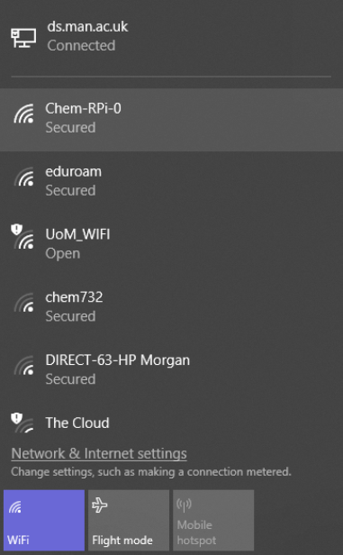
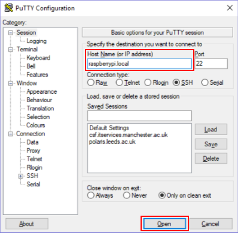
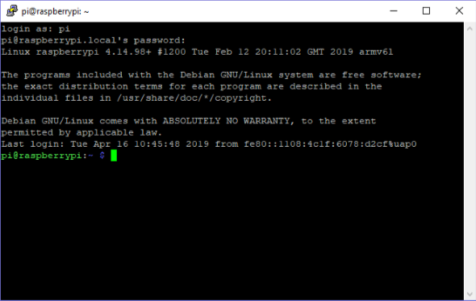
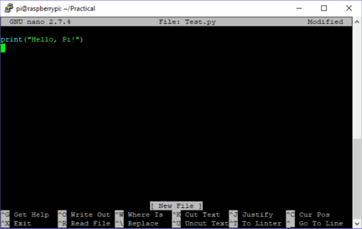
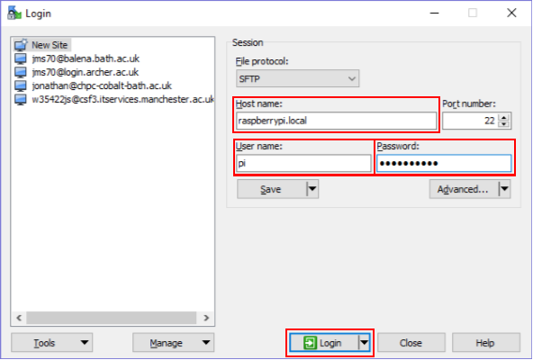
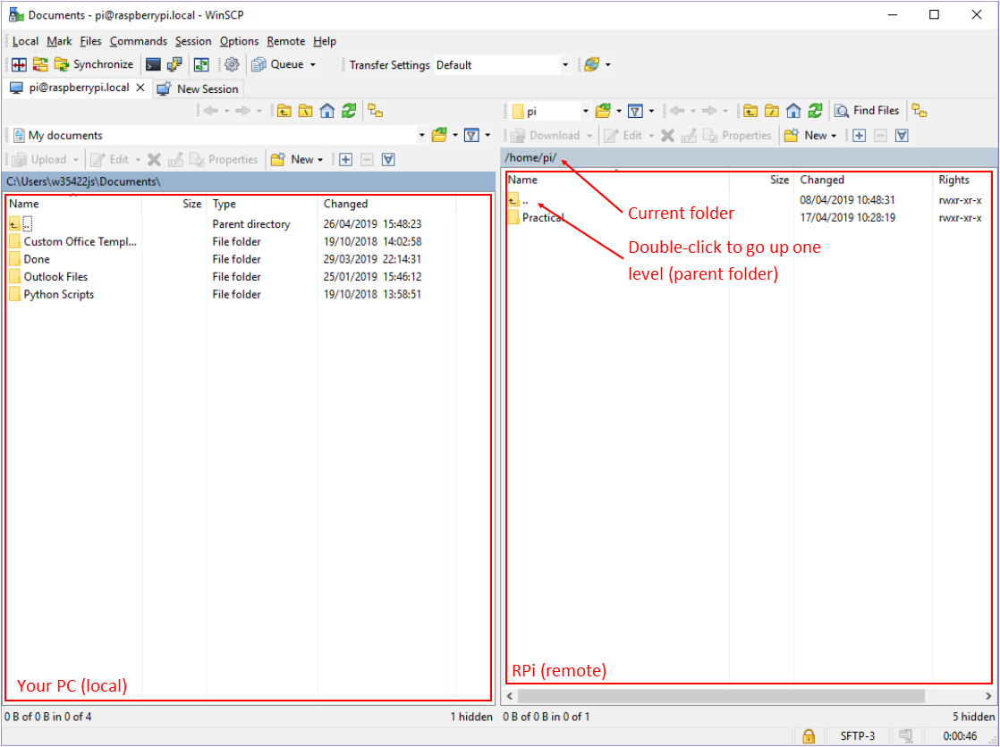
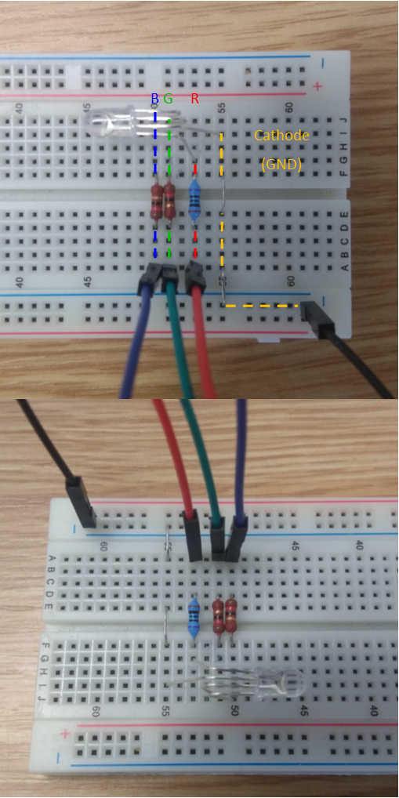
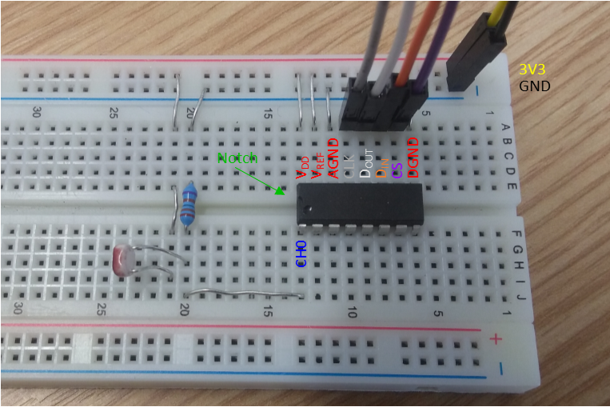
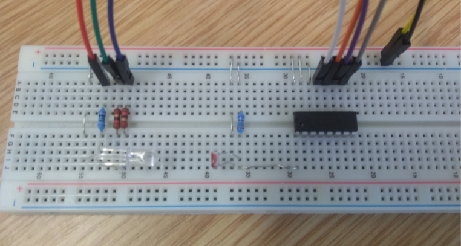

# Building a DIY colourimeter using a Raspberry Pi

In Part 2 of the practical, you will use some of the Python basics you learned in Part 1 to build a "DIY" colourimeter based around a Raspberry Pi (RPi) microcomputer.

In Part 3, you will then investigate the capabilities of your colourimeter by designing and running a set of experiments to study the kinetics of the oxidation reaction between household bleach and a blue food dye.

<hr />


## Contents

<ol>
  <li>
    <a href="#Sec1">RPi basics</a>
    <ol type="a">
      <li><a href="#Sec1a">Getting started</a></li>
      <li><a href="#Sec1b">Accessing the Pi over secure shell (SSH)</a></li>
      <li><a href="#Sec1c">A ten-minute Linux (bash) shell primer</a></li>
      <li><a href="#Sec1d">File transfer with WinSCP</a></li>
    </ol>
  </li>
  <li><a href="#Sec2">Electronics 1: LEDs</a></li>
  <li><a href="#Sec3">Electronics 2: Photoresistors and analogue-to-digital converters</a></li>
  <li><a href="#Sec4">Electronics 3: A DIY colourimeter</a></li>
  <li><a href="#Sec5">Next steps</a></li>
  <li>
    <a href="#Sec6">Appendix</a>
    <ol type="a">
      <li><a href="#Sec6a">Parts list</a></li>
      <li><a href="#Sec6b">Raspberry Pi setup</a></li>
      <li><a href="#Sec6c">Troubleshooting</a></li>
    </ol>
  </li>
  <li><a href="#Sec7">Notes and References</a></li>
</ol>

<hr />


## 1. RPi basics <a name="Sec1"></a>

The Raspberry Pis are a family of low-cost single-board computers created by the [Raspberry Pi Foundation](https://www.raspberrypi.org/about/), primarily to encourage more students to develop programming skills.

Since the first RPi was released in 2012, they have become a very popular platform for "internet of things" (IoT) devices used in projects ranging from environmental monitoring to home automation.

From a research perspective, microcomputers like the Pi are useful for building and testing custom apparatus, either from scratch or by providing a bridge to control other laboratory equipment in software - a lot of instrument development starts from a prototype designed around a programmable controller like a Pi.

In this practical, you will be using the Raspberry Pi Zero W, which is designed to be a fully-functional computer costing ~£10.
A photo of a Pi zero with the main components marked is shown below:

<p align="center">
  
</p>

The Zero W is based around a low-power system-on-a-chip (SoC) (1) that contains a 1 GHz single-core CPU, 512 Mb RAM and a low-power graphics chip.
Although this hardware is much slower than even a mid-range smartphone, it is surprisingly capable and is sufficient to run a full Linux operating system.

The board uses a micro SD card for storage (2) and takes a 5 V power supply over USB (i.e. a standard phone charger) (3).
It has a mini HDMI port that can be used to connect a monitor or TV (4), and a micro USB port (5) for connecting a keyboard/mouse or other devices.
It also has a wireless module that provides WiFi and Bluetooth support.
You will have the option to use the WiFi to work with the Pi during this practical.

Most importantly, the board has a set of general-purpose input/output pins (GPIO pins) (6) that can be controlled from software to interface to electronic components.
We will be using the GPIO pins to power and control our colourimeter

### a. Getting started <a name="Sec1a"></a>

Your Pi has been set up for you with the "Raspbian" Linux operating system.
"Linux" is a family of free, open-source operating systems that provide an alternative to e.g. Windows or MacOS, and is commonly used for research computing and to power small devices (the Android smartphone OS and its derivatives are based on the core part of Linux).
[Raspbian](https://www.raspbian.org) is a customised version of Debian Linux for RPi computers.

There are two options for connecting to the Pi:

#### i. Using WiFi

Your Pi has been set up to broadcast a WiFi hotspot that you can join from a laptop or computer with a wireless adapter.
The name of the hotspot is printed on a sticker on the underside of the board.

Switch the Pi on by connecting the power supply.
The green LED next to the USB power connector should light up to show it is booting.

Wait a minute or so for it to boot, then use your computer to scan for wireless networks.
Once you see the hotspot, join it from your laptop using the password `r@5pb377y`.

<p align="center">
  
</p>

<table>
  <tr>
    <td width="100">
      
    </td>
    <td>
      If you choose to connect using WiFi, you won't be able to use your laptop's WiFi to access the internet, including these instructions (unless it happens to have more than one wireless adapter).
      If you're working from a laptop and connected to the internet using Eduroam or similar, either download these isntructions first, or try the alternative connection method below.
    </td>
  </tr>
</table>


#### ii. Using USB

As an alternative, the RPi has been configured to act as an "ethernet gadget": when the Pi is connected to a computer over its USB port - (5) in the photo above - it identifies itself to the host operating system as a network adapter.

Most operating systems will automatically install appropriate driver software, which will then allow the computer to communicate with the Pi in the same way it would if it was connected over a WiFi network.

To connect using this method, connect the micro USB port (5) on the Pi to the computer.
The Pi will draw its power from the USB port, so you do not need to connect a power supply.

On a Windows computer, if it is the first time it has seen the Pi you will probably see a few popup messages while it installs the driver.
Once the Pi has booted and the drivers are installed, it should be set up and ready to go.

(On a Mac, the installation is usually "silent", but you will be able to see the Pi listed as "RNDIS/Ethernet Gadget" in the System Preferences > Network options.)

<table>
  <tr>
    <td width="100">
      
    </td>
    <td>
      On some Windows 10 PCs, Windows incorrectly identifies the Pi as a serial port and installs the wrong driver.
      This should have been checked and fixed on the lab PCs, but if you are using your own laptop, check the <a href="#Sec6c">Troubleshooting</a> section for some advice on how to fix this.
    </td>
  </tr>
</table>

### b. Accessing the Pi OS over secure shell (SSH) <a name="Sec1b"></a>

Once the Pi is connected, you can access its operating system using the secure shell (`ssh`) protocol.
SSH allows you to log in to a remote computer over a network with a command-line interface (a shell) that can be used to do most, if not all, of the things you would typically do with a graphical desktop.
(SSH is widely used for working with Linux systems remotely, and is used, for example, by computational chemists to access high-performance computing systems.)

On Windows, the [PuTTY program](https://www.ssh.com/ssh/putty/) can be used to start an SSH connection:

* Launch PuTTY, enter `raspberrypi.local` in the Host Name field, and click "Open"

<p align="center">
  
</p>

* If this is the first time PuTTY has seen your Pi, it may show a warning - click "Yes"
* You will be prompted for a username and password, which are: `pi` and `r@5pb377y!`

Once you are logged in, you should have a command prompt similar to the following.
This allows you to send Linux shell commands to the Pi.

<p align="center">
  
</p>

(For Mac users: if you prefer, you should be able to connect to the Pi hotspot/connect it with the USB cable and log in to the Pi by opening the `Terminal` app and typing `ssh pi@raspberrypi.local`.)


### c. A ten-minute Linux (Bash) shell primer <a name="Sec1c"></a>

If you are already familiar with the Linux Bash shell, you can skip this section; if not, the following is a quick demonstration of some of the commands you'll need to work with your Pi:

```bash
$ pwd
/home/pi
```

The `pwd` command prints the current working directory.
The location `/home/pi` is the Linux equivalent of the user folder on Windows (e.g. `C:\Users\jskelton\`).

```bash
$ ls

$ mkdir "Practical"
$ ls
Practical
```

The `ls` command, without any arguments, prints out (lists) the contents of the current directory.
`mkdir Practical` makes a new directory called "Practical" for us to do our work in.
Running `ls` again confirms that the directory was created successfully.

```bash
$ cd "Practical"
$ pwd
/home/pi/Practical
```

`cd "<folder>"` is used to change folders; by typing `pwd` again, you can see we are now inside the "Practical" folder we created.

There are a number of command-line text editors that can be used to create and edit files on the Pi, for example `nano`:

```bash
$ nano "Test.py"
```

This creates an empty file called "Test.py" and displays it in an editor interface like the screenshot below.
Enter the following very simple Python script:

```python
print("Hello, Pi!")
```

<p align="center">
  
</p>

As displayed at the bottom of the editor window, `nano` uses keyboard shortcuts of the form `Ctrl + <function>` to cut, paste, save, etc.
To save the file, type `Ctrl + O`.
You will be asked to confirm the file name to save to - press the return key.
Exit the editor by typing `Ctrl + X`.

You can now try running your script from the command line using the `python` command:

```bash
$ python "Test.py"
Hello, Pi!

```

(The `python` command starts the Python interpreter and tells it to run the script file you pass as an argument.)

When you're finished working, you can disconnect from the Pi by typing:

```bash
$ exit
```

This will close the connection.

Finally, to shut down the Pi safely so you can disconnect the power supply, you can use the `shutdown` command (you will obviously need to log in again if you're following this and have just logged out usign `exit`):

```bash
$ sudo shutdown now
```

The `sudo` prefix tells the Pi to execute the command as a "super user" (equivalent to an administrator on Windows) - this is required to run the `shutdown` command from the terminal - and the `now` argument tells the shutdown program to execute immediately as opposed to scheduling a shutdown for the future.
Shortly after you run the command, the SSH connection will be cut, so PuTTY will show an error message.
The green light on the Pi will blink for a few seconds, then turn off.
You can now safely disconnect the power supply.

<table>
  <tr>
    <td width="100">
      
    </td>
    <td>
      Always shut down the Pi before removing the power (see below).
      If you disconnect it without doing this, you risk corrupting the SD card and losing any work you've stored on it.
    </td>
  </tr>
</table>

Here is a summary of these commands for quick reference (replace angle brackets with file/folder names):

* `pwd` : <u>p</u>rint <u>w</u>orking <u>d</u>irectory
* `ls` : <u>l</u>i<u>s</u>t current directory
* `cd <folder>` : <u>c</u>hange <u>d</u>irectory to &lt;folder&gt;
* `mkdir <folder>` : <u>m</u>a<u>k</u>e <u>dir</u>ectory &lt;folder&gt;
* `nano <file>` : opens &lt;file&gt; in the `nano` text editor (and creates the file if it doesn't already exist)
* `python <file>` : executes &lt;file&gt; with the Python interpreter
* `exit` : disconnect the terminal
* `sudo shutdown now` : shutdown the Pi (disconnects the terminal)


### d. File transfer with WinSCP <a name="Sec1d"></a>

To transfer files to and from the Pi, we will use the [WinSCP program](https://winscp.net).
WinSCP uses the secure file-transfer protocol (SFTP) to transfer files to and from a remote computer, and is a useful companion to an SSH client like PuTTY.

Open the program, enter the login details you used with PuTTY, and click "Login" (Host name: `raspberrypi.local`, User name: `pi`, Password: `r@5pb377y!`).

<p align="center">
  
</p>

As with PuTTY, if this is the first time WinSCP has seen your Pi, it will show a warning message - answer "Yes".
Once connected, you should have an interface similar to the following:

<p align="center">
  
</p>

The left-hand pane allows you to browse the local computer, while the right-hand pane shows the file system on the Pi.
In this image, you can see that you are in the `/home/pi` directory, with the "Practical" folder you created while working through the previous section.
You can drag and drop files from one pane to the other to transfer them.
There are also options to create files and folders, and double-clicking a file on the Pi will open it in a text editor that you can use as an alternative to `nano` if you prefer.

Note that WinSCP does not update the browser window on the remote machine automatically, so if you create a file from the command line you may have to right-click > "Refresh" to see it.

(For Mac users: WinSCP is a Windows-only program, but [FileZilla](https://filezilla-project.org) is a good alternative.)

<hr />


## 2. Electronics 1: LEDs <a name="Sec2"></a>

We will start by building a simple circuit to power and control a light-emitting diode (LED) from a Python script running on the RPi.
To make things more interesting, we will use an RGB (<u>r</u>ed, <u>g</u>reen, <u>b</u>lue) LED.
RGB LEDs have three different semiconductors on the same package, and by combining them with different brightnesses you will be able to program different colours from your script.

LEDs require two connections: an anode, connected to a power supply, and a cathode, through which current flows to the ground.
Your RGB LED has three anodes, one for each colour, and a shared cathode.

The semiconductor material used in the LED determines the the emission wavelength (colour).
The LED you have uses an InAlGaP alloy for the red emitter (&lambda;<sub>max</sub> = 620 nm) and InGaN/GaN alloys for the green and blue emitters (&lambda;<sub>max</sub> = 525/460 nm).

LEDs require a minimum forward voltage to emit light - shorter-wavelength emission generally requires a higher voltage, and longer-wavelength emission requires a lower voltage.
From the [data sheet](https://cdn.shopify.com/s/files/1/0174/1800/files/YH5MMRGBC-4YW.pdf) for the RGB LED you are using, the red and green/blue semiconductors are rated for forward voltages of 2.1 and 3.2 V respectively.

The brightness of an LED is proportional to the current flowing through it.
The three independent LEDs in your RGB LED are each rated to operate at a typical 20 milliamp (mA) forward current, and the anode connections must be made through an appropriate resistor to limit the current at or below this level (otherwise the LED will burn out).

Ohm's law can be used to calculate the required resistance as follows:

<!-- Unfortunately, GitHub Markdown doesn't yet support MathJax. -->

<p align="center">
    
</p>

where <i>V</i><sub>S</sub> and <i>V</i><sub>F</sub> are the supply voltage and LED forward voltage, <i>I</i><sub>F</sub> is the desired forward current through the LED, and <i>R</i> is the value of the resistor we need to use.

The GPIO pins on the Pi can supply a maximum *total* 50 mA of current at 3.3 V, and around 15 mA on any one pin, so we have <i>V</i><sub>S</sub> = 3.3 V and <i>I</i><sub>F</sub> = 15 &times; 10<sup>-3</sup> A.
Using <i>V</i><sub>F</sub> = 2.1 and 3.2 V, we require resistors of 80 and 6 &Omega; for the red and green/blue anodes.

It is fine to use resistors with a higher value than these - the LED brightness will simply decrease proportionally.
You have been provided with 105 and 12.5 &Omega; resistors for this practical.

We will build our circuit using a solderless "breadboard" - as its name suggests, this allows you to connect components together without having to solder the connections.
The breadboard has a series of holes to fit the flexible legs of components, and the holes are connected together by a conductive back plate.

<p align="center">
  
</p>

By convention, the rows in the top and bottom of the image are used to provide supply (+) and ground connections (-).
Rows and columns can be connected using jumper wires or, to keep things tidy, small pieces of flexible wire or solder.
Jumper wires are used to make connections to the GPIO pins on the RPi.

Wire up the LED as shown in the following image.
(You can identify the cathode connection on the LED as the longest of the four legs, and the legs are ordered red, cathode, green, blue - see the [data sheet](https://cdn.shopify.com/s/files/1/0174/1800/files/YH5MMRGBC-4YW.pdf) for a diagram).

You will need to bend the legs to push it into the breadboard; after you've done so, check none of them are touching.
Also note that we have used one of the (-) connected rows as our ground connection - this is not necessary at this stage, but doing so now allows the rail to be shared with other components later.

<p align="center">
  
</p>

Next, we need connect the circuit up to the Pi.
The GPIO pins on the Pi use a non-intuitive numbering scheme (this is because of the way they are connected to the SoC), so it helps to use a reference like [pinout.xyz](https://pinout.xyz) as a guide.
The image below is reproduced from this site; pin 1 (3V3) is the pin closest to the SD card slot on the Zero W (the website has a larger, clearer diagram that is easier to follow).

<p align="center">
  
</p>

<table>
  <tr>
    <td width="100">
      
    </td>
    <td>
      Most of the GPIO pins are connected directly to the SoC without any sort of protection.
      This means it is perfectly possible to damage the RPi - perhaps irreperably - by creating a short circuit.
      It is a good habit to double-check all your wiring before connecting to the power/ground.
    </td>
  </tr>
</table>

We need to make a total of four connections to the Pi:

* The cathode should be connected to one of the eight ground pins - use pin 13 between the "5V" and "UART" pins.
* The resistors on the red, green and blue anodes should be connected to one of the software-controlled "BCM" pins - use 17, 27 and 22.

Once you're happy with your wiring, boot up the Pi if it isn't already running, connect to it again over SSH, and go into your work folder ("Practical" if you followed the Linux tutorial above).

Open a new script in a text editor (e.g. `nano "LEDTest.py"`) and type or copy/paste the following code:

```python
import time
import gpiozero

r_pin = 22
g_pin = 27
b_pin = 17

led = gpiozero.RGBLED(red = r_pin, green = g_pin, blue = b_pin)

led.value = (1.0, 0.0, 1.0)

time.sleep(10.0)
```

The `gpiozero` library is a Python package that allows us to work with the GPIO pins.
`gpiozero` was written by the Raspberry Pi Foundation to make it easier to control common electronic components.

The library has a special object for RGB LEDs (the `RGBLED`).
When we create one, we pass it a set of arguments to tell it which GPIO pins are connected to the red, green and blue anodes.

The object has a `value` property that we can use to set the colour.
This property expects a Python tuple with three values between 0 (off) and 1 (full brightness) - one each for the red, green and blue components.
Setting `led.value = (1.0, 0.0, 1.0)` turns the red and blue semiconductors to 100 % brightness and turns the green component off, which gives magenta.

When `led.value` is set, the LED is automatically switched on.
Since the LED is turned off when the script finishes, we insert a ten second pause using the `sleep()` function in the `time` module.
`sleep()` suspends the script for a set amount of time; as we will see, this and other functions in the `time` module are useful for operating hardware at a set schedule.

Run the script with (replace `LEDTest.py` with your chosen file name if you used something different):

```bash
python "LEDTest.py"
```

The LED should light up for ten seconds and then switch off.
You can try editing the script to change the colour (`nano "LEDTest.py"`) - you should be able to see the three colours turn on with different brightnesses.
(Note that, because of the clear plastic housing, most "mixed" colours don't show as one colour; in a practical device - e.g. something like a Philips Hue light bulb - a white diffuser would be added to produce a more even colour.)

The `RGBLED` object also has in-built functions to make the LED blink and fade between two colours.
Edit your script as follows then run it again from the command line:

```python
# led.value = (1.0, 0.0, 1.0)

led.blink(
    on_time = 2.5, off_time = 2.5,
    on_color = (0.0, 1.0, 0.0),
    off_color = (0.0, 0.0, 1.0)
    )
```

The LED should blink between green and blue, for 2.5 s each, twice before the script exits after the 10 s sleep.

Next, try this:

```python
# led.value = (1.0, 0.0, 1.0)

# led.blink(
#    on_time = 2.5, off_time = 2.5,
#    on_color = (0.0, 1.0, 0.0),
#    off_color = (0.0, 0.0, 1.0)
#    )

led.pulse(
    fade_in_time = 2.5, fade_out_time = 2.5,
    on_color = (1.0, 0.0, 0.0),
    off_color = (0.0, 1.0, 0.0)
    )
```

This time, the LED should fade from red to green, again taking 2.5 s for each transition.

If you're interested, you might want to look at the [documentation](https://gpiozero.readthedocs.io/en/stable/api_output.html) for the `gpiozero.RGBLED` class.
Playing around is encouraged.

<table>
  <tr>
    <td width="100">
      
    </td>
    <td>
      You might be wondering how the code controls the brightness of the LED.
      As a digital controller, the software cannot control the current through the GPIO pins - it can only turn it on and off.
      To give the impression of different brightnesses, the code sets up a square wave with a controllable period (the default is 100 Hz).
      The waveform has a set "duty cycle" - the fraction of a period for which the LED is turned on.
      To get 50 % brightness, the software sets the duty cycle to 50 %; to get 80 %, it sets it to 80 %, and so on.
      As long as the wave period is faster than the human eye can perceive (about 50 Hz), we don't see the flickering and see an averaged brightness.
      This technique is called "pulse width modulation" (PWM).
    </td>
  </tr>
</table>

<hr />


## 3. Electronics 2: Photoresistors and analogue-to-digital converters <a name="Sec3"></a>

We will now connect the Pi to a photoresistor to measure light levels.
A photoresistor uses a <i>photoconductive</i> material (CdS) whose conductivity increases (i.e. resistance decreases) in proportion to the light intensity falling on it.
By measuring the voltage across the photoresistor, we can monitor and record a signal proportional to the light level.

The reading from a photoresistor is a continuous voltage signal (i.e. analogue), whereas the GPIO pins on the Pi are digital.
We will therefore need to use an analogue-to-digital converter (ADC) chip - the MCP3008 - to digitise the voltage reading so we can read it in our Python script.

A connection diagram is shown below - as you can see, there are a lot of connections.

<p align="center">
  
</p>

The connections on the left-hand side of the diagram are the analogue inputs.
The MCP3008 has eight input channels (CH0-CH7) that can be selected by sending appropriate control signals to the chip.

The logic in the chip requires power and ground connections on V<sub>DD</sub> and DGND.
The voltage on the input channels is digitised relative to a reference voltage connected to V<sub>REF</sub> and the channels are grounded to a second ground connection AGND.

Finally, the MCP3008 communicates with controllers using the serial peripheral interface (SPI) protocol, which requires a further four connections:

1. CLK ("clock") provides a timing signal from the Pi to synchronise data transfers.
2. D<sub>IN</sub> is for the chip (slave) to receive data from the Pi (master), and is usually called "MOSI" (<u>m</u>aster <u>o</u>ut <u>s</u>lave <u>i</u>n).
3. D<sub>OUT</sub> is for the chip to send data to the Pi ("MISO" - <u>m</u>aster <u>i</u>n <u>s</u>lave <u>o</u>ut)
4. Finally, the CS ("chip select") pin is to allow the MCP3008 to work alongside other SPI devices (we will not be doing this, but it still needs to be connected).

Set up the MCP3008 and photocell on your breadboard as in the photo below (note the orientation of the notch on the MCP3008).
Connect the V<sub>DD</sub> and V<sub>REF</sub> to the power rail (+), and the DGND and AGND pins to the ground rail (-).

<p align="center">
  
</p>

Make a connection from the power rail (+) to the 3V3 pin on the RPi, and connect the ground rail (-) to one of the ground pins as for the LEDs.

Next, we need to connect the four SPI pins to the RPi.
The Pi supports hardware SPI connections using one of two sets of pins - we will use the following:

* CLK -> pin 11 (labelled "SCLK" on [pinout.xyz](https://pinout.xyz))
* D<sub>IN</sub> -> pin 10 (MOSI)
* D<sub>OUT</sub> -> pin 9 (MISO)
* CS -> pin 8 (CE0)

The power source for the photocell is again the 3V3 pin on the RPi.
The current flows to ground through the CH0 input on the ADC chip, and the photocell is also connected to the ground rail through a high-value resistor (10 k&Omega;) - this is to make sure the zero can be clearly read out.

Connect to the Pi again, go into your work folder, create a new script file (e.g. "ADCTest.py"), and add the following:

```python
import gpiozero

channel = 0
clk_pin = 11
mosi_pin = 10
miso_pin = 9
cs_pin = 8

adc = gpiozero.MCP3008(
    channel = 0,
    clock_pin = clk_pin,
    mosi_pin = mosi_pin,
    miso_pin = miso_pin,
    select_pin = cs_pin,
    )

while True:
    print(adc.value)
```

As for our LED, the `gpiozero` has a dedicated object for our MCP3008 ADC that takes care of controlling the hardware.
When we create an `MCP3008` object, we tell it which pins we connected up for the SPI connection, and which of the eight channels we want to monitor.
Once done, the current reading is accessed through the `value` property - this gives a reading between 0 and 1, where 0 corresponds to the voltage on the AGND and 1 corresponds to V<sub>REF</sub> (in our case, 0 and 3.3 V, respectively).

Run the script with:

```python
python ADCTest.py
```

The script will continuously print the current value to the terminal until you stop it with `Ctrl + C`.
This sends a "keyboard interrupt" to the program, which causes it to stop (Python will display an error message like the one below, possibly with more text before the final `KeyboardInterrupt`).

```
Traceback (most recent call last):
  File "ADCTest.py", line 17, in <module>
    print(adc.value)
KeyboardInterrupt
```

While running, the sensor should read around 0.4-0.6 depending on the ambient lighting.
Use something opaque to cover the photocell (e.g. a piece of card), and you should see the reading drop close to zero.

<table>
  <tr>
    <td width="100">
      
    </td>
    <td>
      If your sensor reading jumps between 0 and 1, or the reading doesn't change as you expect it to when you cover and uncover the photocell, check your wiring.
      Also make sure that the connection from the photocell to the input on the ADC is grounded through a resistor; if it isn't, you may see a signal from stray electrical noise, which can produce a surprisingly large reading. 
    </td>
  </tr>
</table>

<hr />


## 4. Electronics 3: A DIY colourimeter <a name="Sec4"></a>

A colourimiter measures the transmission of a light source through an absorbing medium.
As in a laboratory UV/vis spectrometer, our medium will be a solution in a plastic cuvette.
Reconnect the LED, this time angled toward the photocell with an ~1 cm gap to the photocell.

<p align="center">
  
</p>

Connect to the RPi, go to your work folder, create a new script file (e.g. "Measure.py"), and combine the code from the previous two sections:

```python
import gpiozero
import time

r_pin = 22
g_pin = 27
b_pin = 17

clk_pin = 11
mosi_pin = 10
miso_pin = 9
cs_pin = 8
channel = 0

led = gpiozero.RGBLED(red = r_pin, green = g_pin, blue = b_pin)

adc = gpiozero.MCP3008(
    channel = 0,
    clock_pin = clk_pin,
    mosi_pin = mosi_pin,
    miso_pin = miso_pin,
    select_pin = cs_pin,
    )

led.value = (1.0, 0.0, 0.0)

t_0 = time.time()

while True:
    t = time.time() - t_0
    v = adc.value
    
    print("{0:.3f} s : {1:.3f}".format(t, v))
```

We first set up the RGB LED and the MCP3008/photocell, then we set the red LED to 100 % brightness - this also switches it on.

We use the `time()` function from the `time` module to record the start of the data collection.
`time()` returns the fractional number of seconds since the Pi was last booted, and is usually accurate to around 1 &mu;s.

We then start a `while` loop where we take the current time, subtract the time zero, take a reading, and print the time and reading to the terminal using the `format()` method to print values to 3 d.p.
The measurement can be stopped at any time by sending a keyboard interrupt with `Ctrl + C`.

This code does most of what we require our colourimiter to do - it activates the light source and makes timed measurements of the photocell voltage until we stop it.
Before we're ready to try some "production" experiments, we will make two further improvements:


#### i. Averaging readings

As it is now, the code prints readings from the photocell as fast as it can collect them, which is more than 100 samples/s.
Unless we are measuring a very fast reaction, we probably want to limit the sample rate to avoid collecting an unweildy amount of data - if a reaction takes, say, 5 mins (600 s) to complete, we would measure ~100 &times; 600 = 60,000 data points (!).

Modify the code as follows:

```python
sample_interval = 0.1

t_0 = time.time()

while True:
    t = time.time() - t_0
    v = adc.value
    
    print("{0:.3f} s : {1:.3f}".format(t, v))
    
    time.sleep(sample_interval)
```

We use the `sleep()` function, as we did in the LED example, to instruct the script to pause for a `sample_interval`, here 0.1 s (100 ms), after each reading.
If you run the code again now, you should see the readings being printed more slowly and roughly 100 ms apart.

This limits the rate at which we collect readings, but a better method would be to collect as many readings as we can between sampling intervals and average them.
Averaging readings over a period of time is usually more accurate than collecting single values.
All electronic components are subject to some level of noise, but as a general principle accumulating *N* samples (adding together readings as we do here) increases the intensity of the signal by a factor of *N* and the noise by &radic;*N*, so we get an overall improvement of &radic;*N* in the signal-to-noise ratio (SNR).

The code to do this is more involved, but not too much extra work:

```python
sample_interval = 0.1

t_0 = time.time()

while True:
    t_1 = time.time()
    
    values = []
    
    start_time = time.time()
    
    while time.time() - t_1 < sample_interval:
        values.append(adc.value)
    
    t_2 = time.time()
    
    t_ave = (t_1 + (t_2 - t_1) / 2) - t_0
    v_ave = sum(values) / len(values)
    
    print("{0:.3f} s : {1:.3f}".format(t_ave, v_ave))
```

In the modified loop body, we do the following:

* Set up an empty list to collect values
* Record a start time `t_1`
* Run a second `while` loop which adds readings to the list until the current time minus `t_1` exceeds `sample_interval` (i.e. until we have collected for roughly the desired interval)
* Record an end time `t_2`
* Take the midpoint of `t_1` and `t_2` as `t_1 + (t_2 - t_1) / 2`, then subtract `t_0`.
* Take the average reading by summing the values in the list (`sum()`) and dividing by the number of readings (`len()`).

If you wish, you can test your modified code, although the output will not look very different.

For a 0.1 s sampling interval, the Pi should be able to collect and average > 100 samples per data point.
If you would like to see this, you can modify the code as follows:

```python
sample_interval = 0.1

t_0 = time.time()

while True:
    t_1 = time.time()
    
    values = []
    
    start_time = time.time()
    
    while time.time() - t_1 < sample_interval:
        values.append(adc.value)
    
    t_2 = time.time()
    
    n_vals = len(values)
    
    t_ave = (t_1 + (t_2 - t_1) / 2) - t_0
    v_ave = sum(values) / n_vals
    
    print("{0:.3f} s : {1:.3f} (average of {2} samples)".format(t_ave, v_ave, n_vals))
```


#### ii. Writing data to a file

Finally, in addition to printing readings to the terminal, we will also want to log them to a file for analysis (unless you're a *very* fast writer!).

For this, we can use the `csv` module to write data into a comma-separated values (CSV) file that we will be able to transfer off the Pi and look at in Excel.
CSV files are formatted text files that, as the name suggests, contain values separated by commas:

```
time [s],reading
0.1,0.6
0.2,0.599
0.3,0.597
```

CSV files recognised by most spreadsheet programs (e.g. Excel), and are also quite easy to read into programming languages like Python, Matlab, etc.

Modify the code as follows:


```python
import csv
import gpiozero
import time

...

output_file = "Data.csv"

with open(output_file, 'w') as output_writer:
    output_csv = csv.writer(output_writer)
    
    output_csv.writerow(["time [s]", "reading"])
    
    sample_interval = 0.1
    
    t_0 = time.time()
    
    while True:
        t_1 = time.time()
        
        values = []
        
        start_time = time.time()
        
        while time.time() - t_1 < sample_interval:
            values.append(adc.value)
        
        t_2 = time.time()
        
        t_ave = (t_1 + (t_2 - t_1) / 2) - t_0
        v_ave = sum(values) / len(values)
        
        output_csv.writerow([t_ave, v_ave])
        
        print("{0:.3f} s : {1:.3f}".format(t_ave, v_ave))
```

We set a name for the output file (`output_file`) in the script.
We open the file for writing inside a `with` block, which encloses the data-collection code.
Using the `with` statement means the file will be closed automatically when we stop the script.

We use the `csv.writer` object from the `csv` module to format our data and write it to the output file.
The `writer` class acts as a "wrapper" around an open file, taking rows of data provided as lists, formatting them, and writing them to the file.

When we create the `writer`, we pass it our open file to use.
We then call the `writerow()` method with lists of values to output data.
The lists can contain text strings, numbers, or a mix of the two; before starting the data collection, we call `writerow()` with two column headings to go at the top of the file, then we then call it again in each data-collection cycle with the averaged time and reading to add the data to the file.

Run the code, let it collect for a minute or so, then stop it with `Ctrl + C`.
Try covering and uncovering the photocell while collecting to see a change in signal.
Verify that the output file was created and contains the data you expect.
(You might like to download the file to your laptop/computer and open it in Excel or similar.)


#### iii. Extension task: avoid overwriting previous data

If you're following the code, you might notice one more problem that we ought to solve: if we forget to rename the output file after each measurement or don't change the hard-coded file name in our script, we may end up overwriting data from a previous run.

To avoid this, we can specify a desired "prefix" for our file names (e.g. "Data") and check whether "<prefix>.csv" exists; if it does, append 2, 3, 4, ... until we find an unused file name.

This can be done as follows:

```python

import csv
import gpiozero
import os
import time

...

output_prefix = "Data"

output_file = output_prefix + ".csv"

if os.path.isfile(output_file):
    file_number = 2
    
    while True:
        output_file = "{0}-{1}.csv".format(output_prefix, file_number)
        
        if not os.path.isfile(output_file):
            break
        
        file_number = file_number + 1

...

```

We import the `os` module for the `os.path.isfile()` function.
As its name suggests, this takes a file name as an argument and returns `True` if the file exists or `False` if not.

We define an initial test file name of "<output_prefix>.csv" and check whether this exists.
If it does, we set up a `while` loop and increment a `file_number`, which we use to build alternative file names of the form "<output_prefix>-<file_number>.csv".
We keep counting until we get a file name that doesn't exist, then `break` out of the loop.

If you decide to follow this step, you can check to make sure it's working by running the script a couple of times and checking that the files don't get overwritten.

You might wonder whether a more logical thing to do would be to name the file with the date/time when the measurements were started, as most instrument software does.
Unfortunately, however, the Pi doesn't have a "real time clock" (RTC) to keep track of the time while powered off, so its time is not reliable.
It is, however, perfectly possible to add an RTC using the GPIO pins.

<hr />


## 5. Sumary and next steps <a name="Sec5"></a>

This part of this experiment shows how Python can be used with a microcontroller to control hardware and build a  simple prototype device.
Hopefully you can see the appeal - we've been able to build and program a functional colourimeter in just a few hours of work!

If you look online, you will find companies like [Adafruit Industries](https://www.adafruit.com) and [Pimoroni](https://shop.pimoroni.com) that provide "packaged" components alongside tutorials for connecting them to a Pi and controlling them from software.
This includes everything from sensors to servo motors, LEDs and touch screens.
This makes it very easy to get prototype devices up and running quickly and cheaply, and you then have the flexibility to adapt them to the requirements of your project as it evolves.

For reference, here is the complete measurement code, including the extension task above, with a few comments added to explain what each section of the script does.

When you're ready, you can move on the Part 3 - designing a series of experiments to use your colourimeter to measure the kinetics of an oxidation reaction.
If you're going to break for the day, don't forget to shutdown your Pi.

```python
import csv
import gpiozero
import os
import time

# Parameters.

r_pin = 22
g_pin = 27
b_pin = 17

clk_pin = 11
mosi_pin = 10
miso_pin = 9
cs_pin = 8
channel = 0

# Choose an output file (make sure we don't overwrite prvious files).

output_prefix = "Data"

output_file = output_prefix + ".csv"

if os.path.isfile(output_file):
    file_number = 2
    
    while True:
        output_file = "{0}-{1}.csv".format(output_prefix, file_number)
        
        if not os.path.isfile(output_file):
            break
        
        file_number = file_number + 1

sample_interval = 0.1

# Set up LED and MCP 3008 ADC chip.

led = gpiozero.RGBLED(red = r_pin, green = g_pin, blue = b_pin)

adc = gpiozero.MCP3008(
    channel = 0,
    clock_pin = clk_pin,
    mosi_pin = mosi_pin,
    miso_pin = miso_pin,
    select_pin = cs_pin,
    )

# Switch on LED.

led.value = (1.0, 0.0, 0.0)

# Collect data until the script is stopped.

with open(output_file, 'w') as output_writer:
    output_csv = csv.writer(output_writer)
    
    # Write column headings to output file.
    
    output_csv.writerow(["time [s]", "reading"])
    
    t_0 = time.time()
    
    while True:
        # Average readings over a time period sampling_interval.
        
        t_1 = time.time()
        
        values = []
        
        start_time = time.time()
        
        while time.time() - t_1 < sample_interval:
            values.append(adc.value)
        
        t_2 = time.time()
        
        t_ave = (t_1 + (t_2 - t_1) / 2) - t_0
        v_ave = sum(values) / len(values)
        
        # Write central time and averaged reading to output file.
        
        output_csv.writerow([t_ave, v_ave])
        
        # Print time and reading to terminal.
        
        print("{0:.3f} s : {1:.3f}".format(t_ave, v_ave))
```

<hr />


## 6. Appendix <a name="Sec6"></a>

The information in this section is intended for people who are interested in recreating this system themselves, and does not form part of the practical.

### a. Parts list <a name="Sec6a"></a>

The following table lists the parts we used for this experiment.
For single setups, most of the electronic components can be bought in smaller denominations from other suppliers.

| Part                             | Price  | Supplier                     | Manufacturer #     |
| ----                             | -----  | --------                     | --------------     |
| Raspberry Pi Zero W              | £ 9.30 | Pimoroni (RPI-019)           | -                  |
| 16 GB UHS-1/A1 MicroSDHC card    | £ 4.15 | Softcat Limited ZUV0E9111401 | SDSQUAR-016G-GN6MA |
| 2.5 A Micro USB power supply     | £ 6.89 | Farnell 2534971              | T5989DV            |
| Micro USB cable                  | £ 2.78 | Insight 0001525542-00000001  | UUSBHAUB1m         |
| GPIO hammer headers + jig        | £ 5.00 | Farnell SC14734              | PIM296             |
| RGB LED (pack of 5)              | £ 5.52 | RS Components 861-4304       | L-154A4SURKQBDZGC  |
| MCP3008 (tube of 30)             | £42.60 | RS Components 889-5143       | MCP3008-I/P        |
| CdS LDR (pack of 10)             | £ 6.35 | RS Components 914-6710       | NSL-19M51          |
| 12 &Omega; resistor (pack of 25) | £ 0.63 | RS Components 441-0653       | PR01000101209JA500 |
| 105 &Omega; resistor (pack of 5) | £ 1.00 | RS Components 755-0717       | YR1B105RCC         |
| 2 k&Omega; resistor (pack of 10) | £ 1.14 | RS Components 148-578        | LR1F2K0            |
| Solderless breadboard            | £10.42 | Farnell 2213346              | TW-E40-1020        |
| 10 &times; jumper wires          | £ 2.02 | Farnell 2452749              | PSG-JMP150MF       |
| 0.5 mm lead-free solder          | £23.00 | RS Components 624-6729       | 5540940520 1037    |

### b. Raspberry Pi setup <a name="Sec6b"></a>

* Configuring the Zero W as a WiFi hostpot: [https://www.raspberrypi.org/documentation/configuration/wireless/access-point.md](https://www.raspberrypi.org/documentation/configuration/wireless/access-point.md)

* Configuring the Zero W as an ethernet gadget: [https://gist.github.com/gbaman/975e2db164b3ca2b51ae11e45e8fd40a](https://gist.github.com/gbaman/975e2db164b3ca2b51ae11e45e8fd40a)

### c. Troubleshooting connections <a name="Sec6c"></a>

If Windows 10 fails to recognise a Pi Zero W configured as an ethernet gadget as a network adapter, it may be because of a problem with assigning the correct driver.
A solution to this problem, documented [here](https://www.factoryforward.com/pi-zero-w-headless-setup-windows10-rndis-driver-issue-resolved/), is to use the Device Manager to manually install the [MOD Duo RNDIS driver](http://web1.moddevices.com/shared/mod-duo-rndis.zip).
This is well documented on the [MOD Devices Wiki](https://wiki.moddevices.com/wiki/Troubleshooting_Windows_Connection).

<hr />


## 7. Notes and references <a name="Sec7"></a>

* Equations were prepared with [http://latex2png.com](http://latex2png.com).

* Symbol graphics were reproduced from [https://publicdomainvectors.org](https://publicdomainvectors.org) ([8154](https://publicdomainvectors.org/en/search/8154), [15168](https://publicdomainvectors.org/en/search/15168), [33160](https://publicdomainvectors.org/en/search/33160))
 